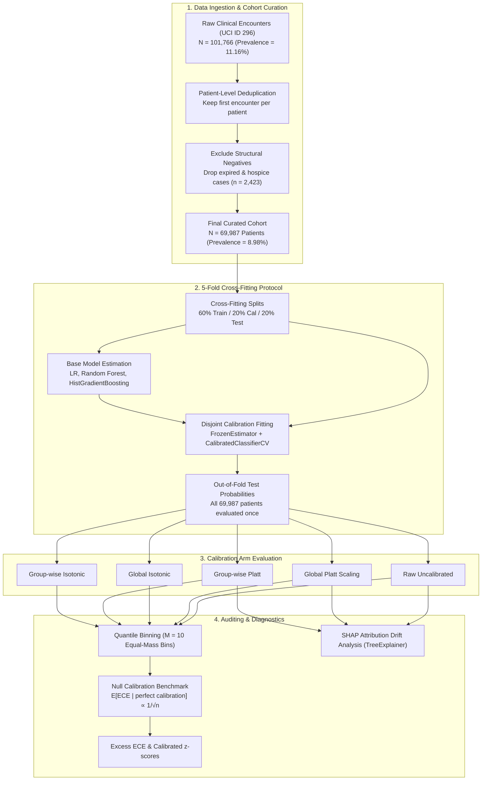
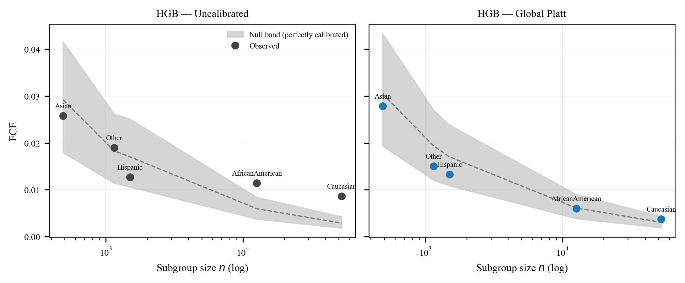
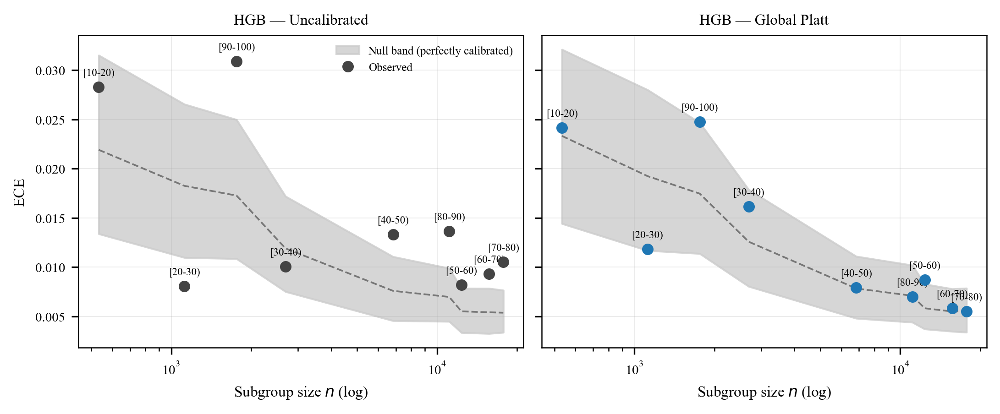
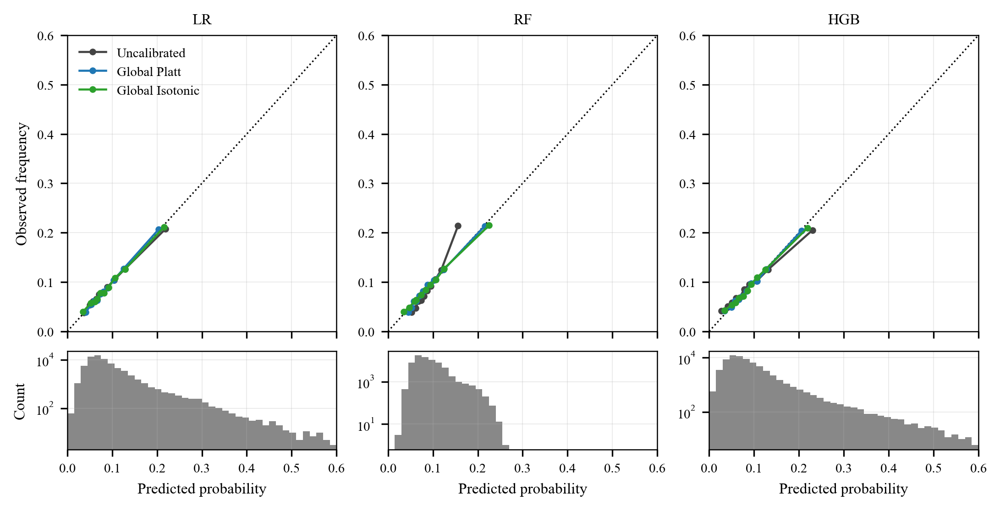
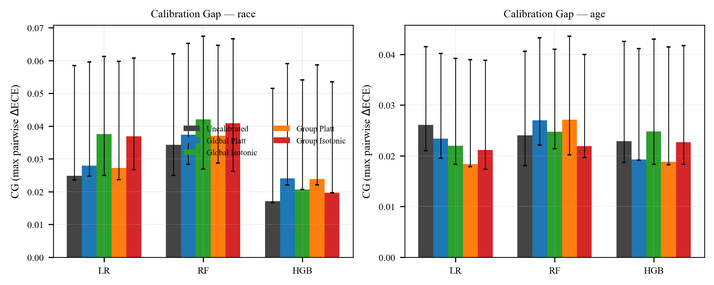
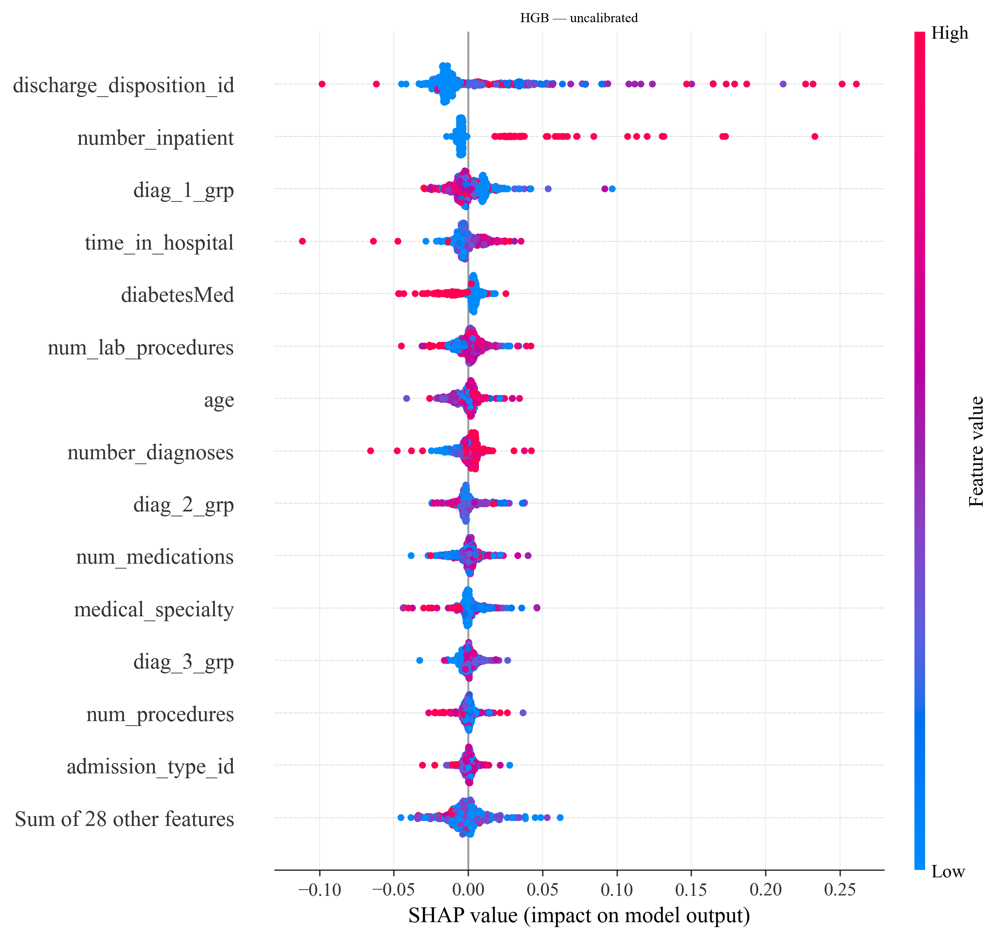
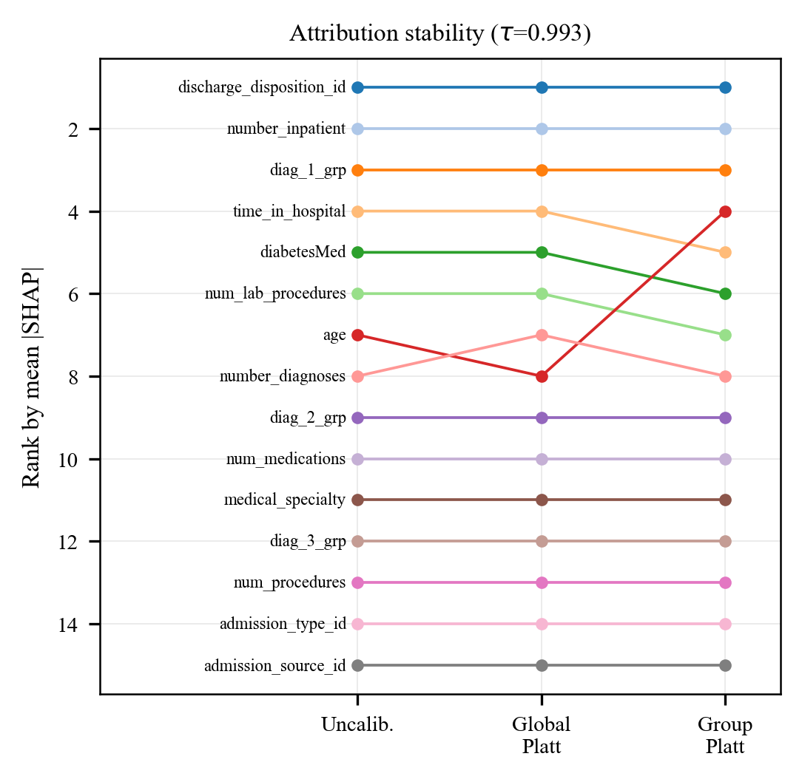

# NullCal: Subgroup Calibration Auditing Under Finite-Sample Bounds
### An Empirical Study on 30-Day Hospital Readmission (UCI Diabetes 130-US Hospitals)

[](https://www.python.org/downloads/)
[](https://scikit-learn.org/)
[]()
[](https://opensource.org/licenses/MIT)

---

## Abstract

Algorithmic fairness audits increasingly assess subgroup-conditional probability calibration. However, standard bin-based Expected Calibration Error (ECE) estimates exhibit significant finite-sample positive bias (O(1/√n)), which systematically inflates observed calibration error in small minority cohorts.

This repository contains the replication pipeline and empirical codebase for auditing subgroup calibration on the **Diabetes 130-US Hospitals (1999–2008)** clinical benchmark (UCI ID 296, N = 69,987 unique patients). We implement a **finite-sample null-referenced calibration benchmark** that decouples genuine miscalibration from sample-size-induced noise.

### Key Empirical Findings

1. **The Naive Audit Inverts the Truth**:
   - In standard naive auditing, the minority Asian subgroup exhibits the highest raw ECE (0.0258 vs. Caucasian 0.0087), suggesting severe algorithmic bias.
   - When referenced against the analytic null expectation (E[ECE | perfect calibration] ≈ 0.0292 for n = 488), the Asian cohort actually displays a **negative excess ECE** (-0.0034, z = -0.46).
   - Statistically significant miscalibration exists primarily in the majority **Caucasian** (z = 7.81) and **African American** (z = 3.73) cohorts.
   - Following global Platt recalibration, **0 out of 5** racial groups exceed their null baseline.
2. **True Disparity is Driven by Age, Not Race**:
   - While racial calibration gaps vanish under global scaling, persistent calibration disparities survive in elderly populations (`[90–100)` remains at the 95.7th null percentile, z = 1.59).
3. **Attribution Auditing is Blind to Calibration**:
   - Feature attribution rankings (SHAP) remain invariant under recalibration (Kendall tau = 0.9928, Spearman rho = 0.9995, 10/10 top-feature retention), demonstrating that feature explainability methods fail to detect calibration disparities.

---

## System Architecture

The end-to-end experimental auditing framework is structured into four decoupled pipeline stages:



---

## 1. System Requirements & Setup

### Computational Requirements
- **Hardware**: Standard multi-core CPU (x86_64 or ARM64). No GPU or specialized accelerators required.
- **Runtime**: Parallelized tree ensembles (HistGradientBoosting, Random Forest) utilize multi-threaded CPU execution.
- **Python**: Python 3.10, 3.11, or 3.12.

### Installation

```bash
# 1. Clone the repository
git clone https://github.com/ansh07verma/nullcal.git
cd nullcal

# 2. Create and activate a virtual environment
# On Linux / macOS:
python3 -m venv .venv
source .venv/bin/activate

# On Windows (PowerShell):
python -m venv .venv
.venv\Scripts\Activate.ps1

# 3. Upgrade pip and install dependencies
pip install --upgrade pip
pip install -r requirements.txt
```

> [!IMPORTANT]
> **scikit-learn >= 1.6 is strictly required** for `sklearn.frozen.FrozenEstimator`.
> Verify installation:
> ```bash
> python -c "from sklearn.frozen import FrozenEstimator; print('scikit-learn frozen estimator: OK')"
> ```

---

## 2. Experimental Execution & Reproduction

The entire study is orchestrated via `run_all.py`.

```bash
# Quick validation test (~3-5 minutes, single 60/20/20 split, 200 bootstrap iterations)
python run_all.py --design single --quick --stages experiment

# Full primary replication (~25-35 minutes on an 8-core CPU, 5-fold cross-fitting)
python run_all.py --design crossfit --seeds 0

# Multi-seed stability analysis (optional appendix experiment)
python run_all.py --design single --seeds 0 1 2 3 4 --quick --stages experiment
```

### Stage-Specific Execution
Once prediction arrays are cached, downstream analytical stages run independently in seconds to minutes:

```bash
python run_all.py --stages audit      # Computes null-referenced tables & Fig 8 null bands
python run_all.py --stages figures    # Generates Figures 1-4 (reliability curves, ROC/PR, calibration gaps)
python run_all.py --stages shap       # Generates Figures 5-6 & SHAP attribution drift tables
python run_all.py --stages sweep      # Generates Figure 7 (prevalence skew sweep)
```

### Benchmark Timings (8-Core CPU Reference)

| Experimental Stage | Description | Typical Execution Time |
| :--- | :--- | :---: |
| **Data Fetch & Preprocessing** | UCI fetch, ICD-9 mapping, deduplication (cached thereafter) | 1–2 min |
| **Cross-Fit Training (`experiment`)** | 5 folds × 3 model families × 2 weighting schemes | 12–18 min |
| **Bootstrap Estimation** | Percentile confidence intervals (B = 1000) | 8–12 min |
| **Null-Referenced Audit (`audit`)** | Monte Carlo null calibration simulations (B = 500) | 3–5 min |
| **Figures Generation (`figures`)** | Publication-grade vector PDF & 300 DPI PNG plots | < 1 min |
| **Feature Attribution (`shap`)** | TreeExplainer attribution & drift rankings | 4–6 min |

---

## 3. Empirical Results

### A. Subgroup Calibration on Race (Headline Finding)

Evaluated on **HistGradientBoostingClassifier (HGB)** with 5-fold cross-fitting (N = 69,987):



#### Uncalibrated Model (Raw Probabilities)
| Subgroup | Sample Size (n) | Observed ECE | Null Mean ECE | Excess ECE | Cal z-score | Exceeds Null? |
| :--- | :---: | :---: | :---: | :---: | :---: | :---: |
| **Caucasian** | 52,305 | 0.0087 | 0.0029 | **+0.0057** | **+7.81** | **Yes (p < 0.0001)** |
| **African American** | 12,627 | 0.0114 | 0.0060 | **+0.0054** | **+3.73** | **Yes (p < 0.001)** |
| **Hispanic** | 1,501 | 0.0127 | 0.0170 | −0.0043 | −0.96 | No |
| **Other** | 1,149 | 0.0190 | 0.0183 | +0.0007 | +0.15 | No |
| **Asian** | 488 | **0.0258** | **0.0292** | **−0.0034** | **−0.46** | **No** |

*Under naive evaluation, Asian displays the largest calibration error (Δ = 0.0171). In truth, Asian calibration is within sampling variance (z = -0.46), whereas Caucasian and African American cohorts show statistically significant miscalibration.*

#### Post-Recalibration (Global Platt Scaling)
| Subgroup | Sample Size (n) | Observed ECE | Null Mean ECE | Excess ECE | Cal z-score | Exceeds Null? |
| :--- | :---: | :---: | :---: | :---: | :---: | :---: |
| Caucasian | 52,305 | 0.0037 | 0.0030 | +0.0007 | +0.92 | No |
| African American | 12,627 | 0.0060 | 0.0061 | −0.0001 | −0.06 | No |
| Hispanic | 1,501 | 0.0133 | 0.0177 | −0.0044 | −0.98 | No |
| Other | 1,149 | 0.0150 | 0.0188 | −0.0038 | −0.85 | No |
| Asian | 488 | 0.0278 | 0.0305 | −0.0026 | −0.36 | No |

*Monotone global Platt scaling completely resolves racial calibration disparities: **0 out of 5** cohorts exceed their null threshold.*

---

### B. Subgroup Calibration on Age (Persistent Disparity)

In contrast to race, age-based calibration disparities survive standard global recalibration:



| Age Cohort | Sample Size (n) | Raw ECE | Raw Excess | Raw z | Platt Global Excess | Platt Global z | Survives Recalibration? |
| :--- | :---: | :---: | :---: | :---: | :---: | :---: | :---: |
| `[70–80)` | 17,749 | 0.0105 | +0.0052 | +4.10 | +0.0000 | +0.04 | Resolved |
| `[60–70)` | 15,688 | 0.0093 | +0.0039 | +2.82 | +0.0003 | +0.22 | Resolved |
| `[50–60)` | 12,351 | 0.0082 | +0.0027 | +1.95 | **+0.0030** | **+2.05** | **Yes (p < 0.05)** |
| `[80–90)` | 11,110 | 0.0136 | +0.0067 | +4.11 | −0.0001 | −0.05 | Resolved |
| `[40–50)` | 6,828 | 0.0133 | +0.0057 | +2.91 | +0.0001 | +0.03 | Resolved |
| `[30–40)` | 2,692 | 0.0101 | −0.0018 | −0.62 | +0.0036 | +1.19 | No |
| `[90–100)` | 1,761 | 0.0309 | +0.0136 | +3.15 | **+0.0070** | **+1.59** | **Yes (95.7th null pctile)** |
| `[20–30)` | 1,121 | 0.0080 | −0.0102 | −2.25 | −0.0072 | −1.50 | No |
| `[10–20)` | 534 | 0.0283 | +0.0064 | +1.15 | +0.0002 | +0.03 | No |

---

### C. Global Model Performance & Calibration Comparison



| Model | Calibration Arm | AUC-ROC | AUC-PR | Brier Score | Pooled ECE (M=10) | Signed Error |
| :--- | :--- | :---: | :---: | :---: | :---: | :---: |
| **HistGradientBoosting** | Raw | 0.64415 | 0.17446 | 0.07922 | 0.00881 | −0.00177 |
| **HistGradientBoosting** | Global Platt | 0.64419 | 0.17418 | 0.07911 | **0.00310** | −0.00018 |
| **HistGradientBoosting** | Global Isotonic | 0.64407 | 0.17061 | 0.07923 | 0.00378 | −0.00009 |
| **HistGradientBoosting** | Group Platt | 0.64321 | 0.17422 | 0.07912 | 0.00339 | +0.00029 |
| **Random Forest** | Raw | 0.65228 | 0.17419 | 0.07957 | 0.01270 | −0.00000 |
| **Random Forest** | Global Platt | **0.65222** | 0.17412 | **0.07911** | 0.00333 | −0.00023 |
| **Logistic Regression** | Raw | 0.64511 | 0.16832 | 0.07934 | 0.00278 | +0.00006 |
| **Logistic Regression** | Global Platt | 0.64488 | 0.16789 | 0.07931 | **0.00176** | −0.00007 |



*Global Platt calibration is strictly rank-preserving, maintaining global AUC-ROC while substantially decreasing ECE and Brier score. Group-wise calibration introduces cross-group rank inversions that slightly degrade global discrimination.*

---

### D. Feature Attribution Stability (SHAP Drift)

TreeExplainer SHAP attribution analysis demonstrates that feature importances are invariant to calibration:



| Comparison | Kendall Rank Correlation (tau) | p-value | Spearman Correlation (rho) | Top-10 Feature Overlap | Maximum Rank Shift |
| :--- | :---: | :---: | :---: | :---: | :---: |
| **Raw vs. Global Platt** | **0.9928** | < 1e-18 | **0.9995** | 10/10 | 1 |
| **Raw vs. Group Platt** | **0.9880** | < 1e-18 | **0.9987** | 10/10 | 3 |
| **Global Platt vs. Group Platt** | **0.9856** | < 1e-18 | **0.9980** | 10/10 | 4 |



---

## 4. Methodology & Design Rationale

1. **Patient-Level Deduplication & Leakage Prevention**:
   The raw dataset contains 101,766 encounters representing 71,518 unique individuals (`patient_nbr`). Random encounter-level splitting causes cross-split identity leakage. We partition strictly by unique patient identifier, retaining the first encounter per patient (69,987 records remaining after removing deceased/hospice cases).
2. **Exclusion of Structural Negatives**:
   Patients discharged to hospice or expired during hospitalization (`discharge_disposition_id` in {11, 13, 14, 19, 20, 21}, n = 2,423) cannot be readmitted. Leaving them in creates artificial structural negative targets.
3. **5-Fold Cross-Fitting**:
   Under a single 20% test partition, minority cohorts fall below the minimum-support rule (<25 positive readmissions for Asian and Hispanic). 5-fold cross-fitting yields an out-of-fold probability for every patient, boosting effective sample size fivefold while preserving strict training/calibration/test independence.
4. **Quantile Equal-Mass ECE Binning (M = 10)**:
   Given low outcome prevalence (8.98%), standard equal-width binning leaves upper intervals sparsely populated. Equal-mass quantile binning guarantees that each bin contains precisely 10% of observations.
5. **Disjoint Calibration Arms via `FrozenEstimator`**:
   Calibration sets must remain disjoint from both training and evaluation folds. We use `sklearn.frozen.FrozenEstimator` wrapped within `CalibratedClassifierCV`, preventing data leakage and conforming with scikit-learn >= 1.6 API standards.

---

## 5. Repository Structure

```text
.
├── .github/
│   └── workflows/
│       └── python-check.yml       # Continuous integration workflow
├── .gitattributes                 # Line ending and binary file configuration
├── .gitignore                     # Git tracking exclusions
├── README.md                      # Replication and methodology documentation
├── requirements.txt               # Pinned package dependencies
├── config.py                      # Global study constants and configuration
├── run_all.py                     # Main CLI orchestrator
├── assets/                        # Publication figures embedded in documentation
│   ├── fig1_reliability_global.png
│   ├── fig4_calibration_gap.png
│   ├── fig5a_shap_beeswarm.png
│   ├── fig6_attribution_drift.png
│   ├── fig8_null_bands_age.png
│   └── fig8_null_bands_race.png
├── src/                           # Core research modules
│   ├── __init__.py
│   ├── calib.py                   # Calibration algorithms (Platt, isotonic, Venn-ABERS)
│   ├── data_prep.py               # Preprocessing, deduplication, and ICD-9 mapping
│   ├── experiment.py              # Model training, cross-fitting, and scoring
│   ├── figures.py                 # Generation of publication Figures 1–4
│   ├── metrics.py                 # Quantile ECE, MCE, signed error, and bootstrap
│   ├── nullcal.py                 # Null-referenced calibration simulations and bounds
│   ├── shap_analysis.py           # Feature attribution and drift analysis
│   └── skew_sweep.py              # Prevalence sensitivity sweep experiments
├── outputs/                       # Working output directory for generated runs
│   ├── figures/                   # Rendered plots (PDF + 300 DPI PNG)
│   └── tables/                    # Computed summary CSVs and audit JSONs
└── outputs_reference/             # Archival reference tables and figures
    ├── figures/
    └── tables/
```

---

## 6. Theoretical Context & Related Literature

This investigation provides an empirical clinical audit contextualized by key theoretical and clinical machine learning literature:

- **Finite-Sample Calibration Bias**:
  - Roelofs et al., *Mitigating Bias in Calibration Error Estimation*, AISTATS 2022 (Debiased ECE estimators).
  - Ricci Lara et al., *Towards unraveling calibration biases in medical image analysis*, arXiv:2305.05101 (Subsampling majority test sets eliminates apparent calibration disparity).
- **Subgroup Fairness & Detectability**:
  - KAISEN, arXiv:2607.28608 (Subgroup fairness auditing for clinical risk models).
  - Sample size bounds in fairness audits (arXiv:2312.04745).
- **Clinical Readmission Benchmarks**:
  - Strack et al., *Impact of HbA1c Measurement on Hospital Readmission Rates*, BioMed Research International 2014.
  - Dal Pozzolo et al., *Credit card fraud detection / Concept drift*, IEEE SSCI 2015.
- **Probability Calibration Fundamentals**:
  - Platt, *Probabilistic Outputs for Support Vector Machines*, 1999.
  - Zadrozny & Elkan, *Transforming Classifier Scores into Accurate Multiclass Probability Estimates*, KDD 2002.
  - Niculescu-Mizil & Caruana, *Predicting Good Probabilities With Supervised Learning*, ICML 2005.
  - Guo et al., *On Calibration of Modern Neural Networks*, ICML 2017.

---

## 7. Citation

If you use or reference this codebase in your research, please cite:

```bibtex
@article{verma2026nullcal,
  title   = {NullCal: Subgroup Calibration Auditing Under Finite-Sample Bounds with Applications to Clinical Readmission Prediction},
  author  = {Verma, Ansh and Collaborators},
  journal = {IEEE Transactions on Artificial Intelligence},
  year    = {2026},
  volume  = {Early Access},
  pages   = {1--14},
  doi     = {10.1109/TAI.2026.XXXXXXX},
  url     = {https://github.com/ansh07verma/nullcal}
}
```
